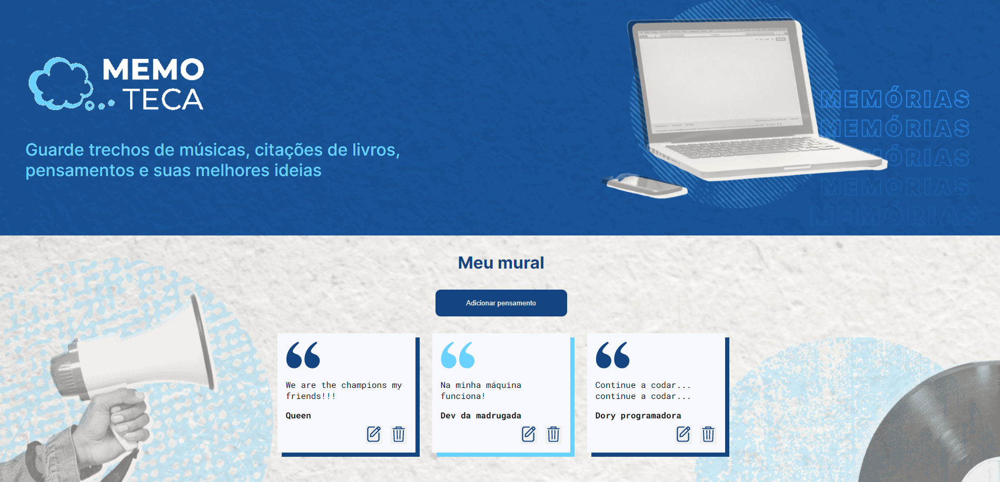

<h1 align="center">
    
</h1>

<br>

## 🧪 Tecnologias

Esse projeto foi desenvolvido com as seguintes tecnologias:

- [Angular](https://angular.io/)
- [JSON Server](https://www.npmjs.com/package/json-server)
- [TypeScript](https://www.typescriptlang.org/)

## 🚀 Como executar

Clone o projeto e acesse a pasta do mesmo.

```bash
$ git clone https://github.com/juanvieiraprado99/memoteca.git
$ cd memoteca
```

Para iniciá-lo, siga os passos abaixo:
```bash
# Instalar as dependências do front-ent
$ npm i

# Entrar no diretório backend
$ cd backend/

# Instalar as dependências do back-end
$ npm i 

# Executar back-end
$ npm run start

# Executar o front-end
$ ng s
```
O app estará disponível no seu browser pelo endereço http://localhost:3000.

## 💻 Projeto

Memoteca é um projeto para as pessoas registrarem seus pensamentos, onde eles podem ser editados excluídos.

O projeto foi feito utilizando angular com typescript para o Front-end e para o Back-end foi utilizado o JSON Server para simular um API REST.

## 📝 License

Esse projeto está sob a licença MIT. Veja o arquivo [LICENSE](LICENSE.md) para mais detalhes.
